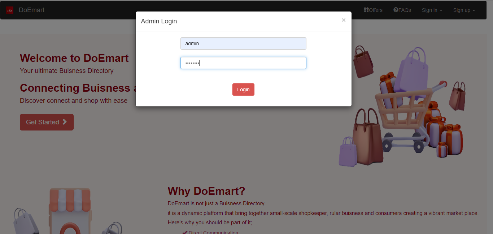

# DoEmart - Business Directory Website

## 📌 Project Overview
DoEmart is an online business directory platform designed to help users find and list businesses with ease. It provides a centralized location for businesses to showcase their services while allowing users to discover relevant businesses based on their needs. The platform aims to bridge the gap between local businesses and potential customers.

## 🚀 Features
- **Business Listings** – Businesses can create and manage their listings.
- **User Authentication** – Secure login and registration system for business owners and users.
- **Reviews & Ratings** – Users can leave feedback and rate businesses.
- **Responsive UI** – Mobile-friendly and easy-to-navigate interface.
- **Admin Dashboard** – Manage business listings, users, and site activities.

## 🛠️ Technology Stack
### Frontend:
- HTML, CSS, Bootstrap
- JavaScript

### Backend:
- Python

### Database:
- MySQL (Managed via XAMPP Server)

### Additional Tools & Libraries:
- REST API for data communication
- JWT for authentication

## 🏗️ Installation Guide
### Prerequisites:
- Python 3.x installed
- XAMPP Server installed and running (for MySQL database setup)

### Steps to Setup Locally:
1. **Clone the Repository:**
   ```sh
   git clone https://github.com/your-username/doemart.git
   cd doemart
   ```
2. **Set up a Virtual Environment:**
   ```sh
   python -m venv venv
   source venv/bin/activate   # On Windows: venv\Scripts\activate
   ```
3. **Install Dependencies:**
   ```sh
   pip install -r requirements.txt
   ```
4. **Database Setup:**
   - Open **XAMPP Control Panel** and start **MySQL**.
   - Create a new database named `doemart` in **phpMyAdmin**.
   - Configure database settings in the project’s environment file.

5. **Database Migration:**
   ```sh
   python manage.py migrate
   ```
6. **Run the Development Server:**
   ```sh
   python manage.py runserver
   ```
7. **Open the Application:**
   - Visit `http://127.0.0.1:8000/` in your browser.

## 📖 Usage Instructions
- **Register/Login** as a business owner or user.
- **List a Business** by filling out relevant details.
- **Search for Businesses** using the search bar.
- **Leave Reviews and Ratings** on business profiles.

## 📸 Screenshots

### Homepage


### Admin Login


### Admin Dashboard


### Shopkeeper Signup


### Shopkeeper Login


### Shopkeeper Dashboard


### Shopkeeper Profile


### Shopkeeper Product Details


### Shopkeeper Add products


### Shopkeeper Edit products


### Shopkeeper New orders


### User Signup


### User Login


### User Homepage


### User Product listing 


### User Product Details with shop profile


### User Order page


### User order history


## 👨‍💻 Contributors
- [Muruga Sutha K](https://github.com/Murugasutha)

## 📞 Contact
For any queries or contributions, feel free to reach out at murugasutha18@gmail.com or visit [GitHub](https://github.com/Murugasutha).

